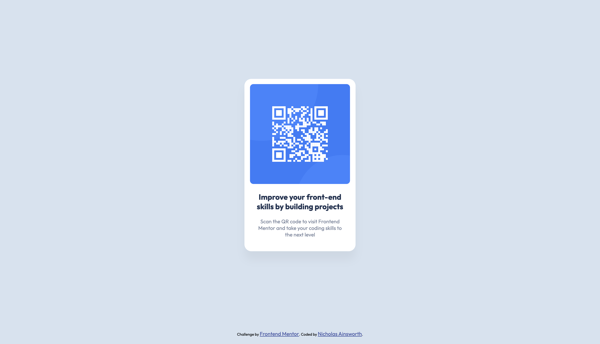

# Frontend Mentor - QR code component solution

This is a solution to the [QR code component challenge on Frontend Mentor](https://www.frontendmentor.io/challenges/qr-code-component-iux_sIO_H). Frontend Mentor challenges help you improve your coding skills by building realistic projects.

## Table of contents

- [Overview](#overview)
  - [Screenshot](#screenshot)
  - [Links](#links)
- [My process](#my-process)
  - [Built with](#built-with)
- [Author](#author)

**Note: Delete this note and update the table of contents based on what sections you keep.**

## Overview

### Screenshot

### Links

- Solution URL: [https://www.frontendmentor.io/solutions/qr-code-component-LCaklMukdG](https://www.frontendmentor.io/solutions/qr-code-component-LCaklMukdG)
- Live Site URL: [https://nainsworth.github.io/qr-code-component/](https://nainsworth.github.io/qr-code-component/)

## My process

### Built with

- Semantic HTML5 markup
- CSS custom properties
- Flexbox
- CSS Grid
- Mobile-first workflow

**Note: These are just examples. Delete this note and replace the list above with your own choices**

## Author

- GitHub - [nainsworth](https://github.com/nainsworth)
- Frontend Mentor - [@nainsworth](https://www.frontendmentor.io/profile/nainsworth)
<!-- - LinkedIn - [@yourusername](https://www.twitter.com/yourusername) -->
